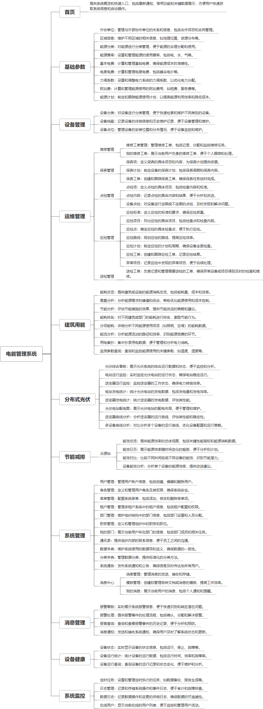

 

    
 

公司拥有上百套具有自主知识产权的软件系统，详情请查看码云首页或公司官网

 
<h1>电能管理系统</h1>

<a href="https://www.haishi.net.cn/">公司官网</a> ｜ <a href="https://www.haishi.net.cn/">在线体验</a>

 

## 系统介绍

“工厂电能管理系统” 是一款集设备管理、维修管理、能耗监测、节能分析、储能管理、充电桩管理、冷源站管理、报警管理、点检管理等功能于一体的综合性平台。系统通过对工厂内各类设备、能源数据的实时采集、分析和管理，实现对工厂用电的精细化控制，从而达到降低能耗、提高能源利用效率、优化设备运行等目的。系统涵盖了从设备基础信息录入、维修工单管理，到能耗数据分析、节能措施评估的全过程，
“工厂电能管理系统” 是一款集设备管理、维修管理、能耗监测、节能分析、储能管理、充电桩管理、冷源站管理、报警管理、点检管理等功能于一体的综合性平台。系统通过对工厂内各类设备、能源数据的实时采集、分析和管理，实现对工厂用电的精细化控制，从而达到降低能耗、提高能源利用效率、优化设备运行等目的。系统涵盖了从设备基础信息录入、维修工单管理，到能耗数据分析、节能措施评估的全过程，
本项目名称为电能管理系统，是一款面向企业级用户的能源管理平台，旨在帮助用户实现能源的高效管理、分析和优化。该系统涵盖了设备管理、运维管理、建筑用能、分布式光伏、节能减排、系统管理、设备健康、消息管理等多个模块，可以满足不同类型用户的能源管理需求。
本项目主要面向企业内部管理人员，提供一个统一的平台来管理和分析能源数据。
- 管理端系统：企业内部管理人员使用，可以进行设备管理、运维管理、建筑用能分析、分布式光伏监控、节能减排分析、系统管理、设备健康监控、消息管理等。
                

## 系统功能介绍

### 系统包含终端说明

管理端（WEB）

| 序号 | 模块               | 模块说明 |
| ---- | ------------------ | -------- |
| 1    | GC-EMS-DNGL-SERVER | 服务端   |
| 2    | GC-EMS-DNGL-MANAGE | 管理端   |

### 系统功能结构

### 系统功能说明

本项目包含以下重要功能：
- **建筑用能分析**: 提供能耗总览、需量分析、节能分析、能耗排名、分项能耗、能流分析、用电集抄、检测参数查询等功能，帮助用户全面掌握建筑用能情况。
- **分布式光伏监控**: 提供光伏综合看板、电站运行监控、逆变器运行监控、电站发电统计、逆变器发电统计、光伏电站配电图、逆变器曲线分析、多设备曲线分析等功能，帮助用户实时监控光伏发电系统运行状态。
- **设备管理**: 提供设备分类、设备档案、设备点位等功能，帮助用户实现对设备的全生命周期管理。
- **运维管理**: 提供维修管理、保养管理、点检管理、巡检管理、送检管理等功能，帮助用户提高设备运维效率。
- **节能减排**: 提供能效总览、能效对比、设备能效分析等功能，帮助用户制定节能减排方案。

## 系统主要界面

## 系统技术说明

### 代码模块说明

| 序号 | 目录                                    | 目录说明 |
| ---- | --------------------------------------- | -------- |
| 1    | GC-EMS-DNGL-SERVER/jeecg-boot-base-core | --       |
| 2    | GC-EMS-DNGL-SERVER/jeecg-module-demo    | --       |
| 3    | GC-EMS-DNGL-SERVER/px_module_cmms       | --       |
| 4    | GC-EMS-DNGL-SERVER/jeecg-module-system  | --       |
| 5    | GC-EMS-DNGL-SERVER/.github              | --       |
| 6    | GC-EMS-DNGL-SERVER/px_module_ems        | --       |
| 7    | GC-EMS-DNGL-SERVER/px_module_base       | --       |
| 8    | GC-EMS-DNGL-SERVER/.gitee               | --       |
| 9    | GC-EMS-DNGL-SERVER/px_module_tpm        | --       |

### 系统技术选型

#### 开发语言/框架

JAVA（JDK1.8）
前端框架：VUE2
脚手架：Jeecg
框架：SpringBoot2.x
系统结构：单体应用

#### 服务中间件

Nginx
Tomcat

#### 数据库

MySQL（5.7+）

#### 其他说明

无

## 系统演示/商用

请扫码添加客服微信获取演示地址和系统详细资料。

如果您想基于电能管理系统进行商业化交付或定制开发服务，我们提供有偿的技术服务支持，合作模式不限，欢迎沟通！

公司官网地址： <a href="https://www.haishi.net.cn/">https://www.haishi.net.cn</a>

联系客服获取专业回答。

## 使用须知

1、 本项目商用必须获得版权所有者的授权。

2、 未经允许本项目代码不允许二次出售。

